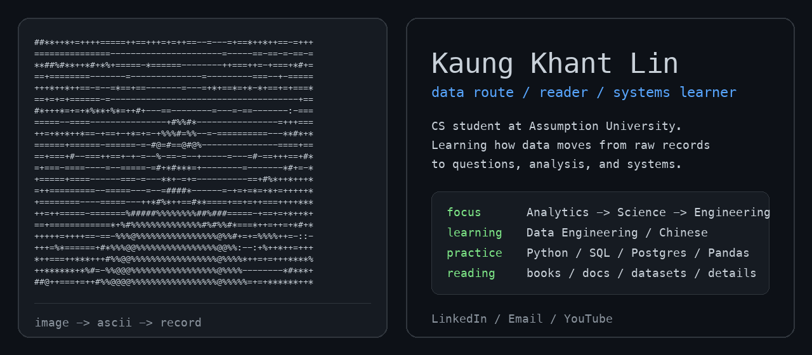

<p align="center">
  <a href="https://www.linkedin.com/in/kaungkhantlin-kinosaur/">LinkedIn</a>
  /
  <a href="mailto:kaungkhantlin999@gmail.com">Email</a>
  /
  <a href="https://www.youtube.com/@whoiskino">YouTube</a>
</p>

```txt
raw records -> questions -> queries -> patterns -> systems
```

```txt
SQL                 ask better questions
Python / Pandas     inspect and transform data
Statistics          understand uncertainty
PostgreSQL          model and store information
Pipelines           move data reliably
```

<details>
  <summary>activity</summary>

  <br>

  <div align="center">
    
    
  </div>

  <br>

  <picture>
    <source media="(prefers-color-scheme: dark)" srcset="https://raw.githubusercontent.com/Kinosaur/Kinosaur/output/github-snake-dark.svg" />
    <source media="(prefers-color-scheme: light)" srcset="https://raw.githubusercontent.com/Kinosaur/Kinosaur/output/github-snake.svg" />
    
  </picture>
</details>
