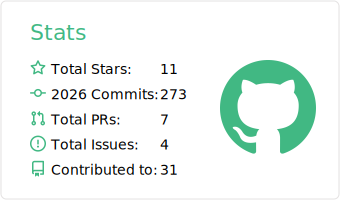
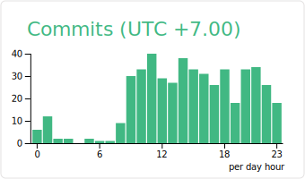
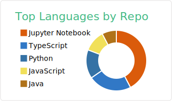
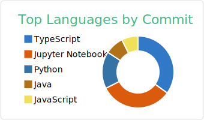

## Current Path

Building toward **data analytics**, **data science**, and **data engineering**.

- Learning: Data Engineering on DataCamp, Chinese
- Practicing: Python, SQL, PostgreSQL, Pandas, NumPy, Excel, Jupyter
- Reading: documentation, datasets, and details

## GitHub

  
  

  
  

## Activity

<picture>
  <source media="(prefers-color-scheme: dark)" srcset="https://raw.githubusercontent.com/Kinosaur/Kinosaur/output/github-snake-dark.svg" />
  <source media="(prefers-color-scheme: light)" srcset="https://raw.githubusercontent.com/Kinosaur/Kinosaur/output/github-snake.svg" />
  
</picture>
